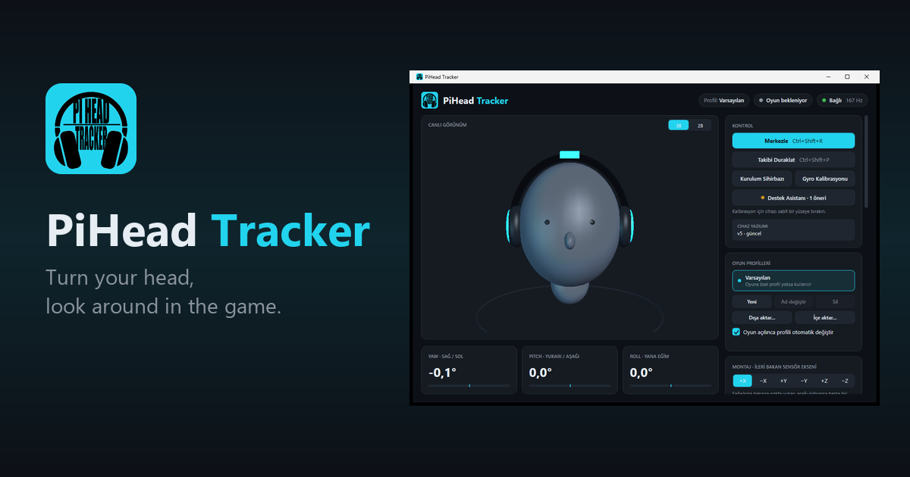
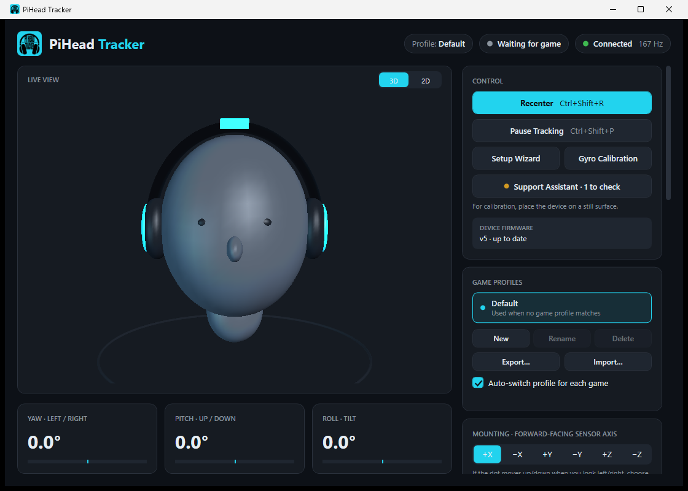
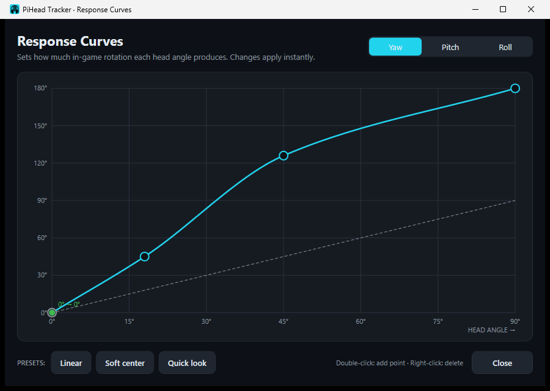
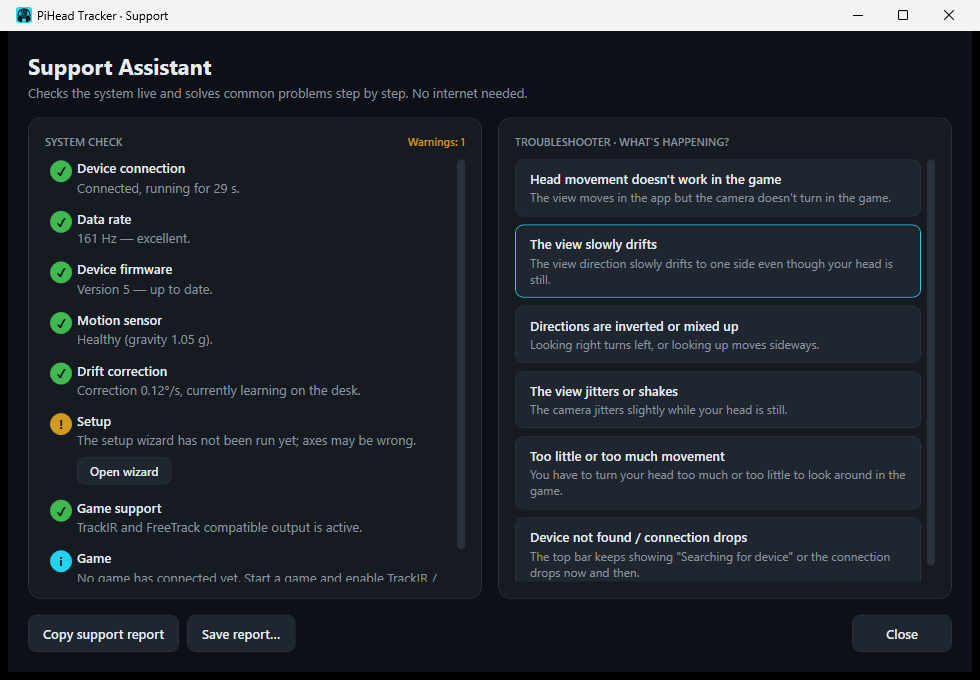

  

  <b>English</b> · <a href="README.tr.md">Türkçe</a>

  <a href="https://piheadtracker.com/en/">Website</a> ·
  <a href="https://piheadtracker.com/en/download">Download</a> ·
  <a href="https://piheadtracker.com/en/guide">User guide</a> ·
  <a href="https://piheadtracker.com/en/games">Games</a> ·
  <a href="https://piheadtracker.com/en/support">Support</a>

PiHead Tracker is a small head tracker that clips onto the headband of your headset. Turn your head to the right and the in-game camera turns right with it. No camera, no infrared lights and no drivers to install.

This page is where we post news about the product and where you can share feedback with the team. The app and the device firmware are not open source, so you won't find source code here.

## How it works

The device measures how far your head turns and the free Windows app passes that angle to the game as camera movement. Games see it as a regular head tracker through the TrackIR and FreeTrack interfaces, so there's nothing to set up in each game apart from turning head tracking on.

- Turning left and right (yaw)
- Looking up and down (pitch)
- Tilting sideways (roll)

PiHead Tracker follows head rotation only. It doesn't measure leaning forward, back or sideways; that needs a camera-based system.

## The app

  

- Setup wizard that works out the mounting direction by itself
- Response curves, sensitivity and smoothing for each axis
- Game profiles that switch automatically when a game starts
- Auto recenter and drift learning for long sessions
- Recenter and pause on a keyboard shortcut or a joystick, HOTAS or wheel button
- Support Assistant that checks the connection, sensor and game and explains what's wrong
- Automatic updates for both the app and the device
- English and Turkish interface

  
  &nbsp;
  

## Specifications

| | |
|---|---|
| Tracked axes | Yaw, pitch, roll |
| Update rate | About 160 readings per second |
| Sensor | 6-axis motion sensor (gyroscope and accelerometer) |
| Connection | USB, no driver needed |
| Game support | TrackIR and FreeTrack protocols |
| Operating system | Windows 10 and Windows 11, 64-bit |
| App | Free, English and Turkish, updates automatically |
| Mounting | On the headband of a headset, in any orientation |

## Discussions

Use [Discussions](../../discussions) to:

- read announcements about new versions,
- share feedback and ideas about the app or the device,
- ask a question about setup or use,
- show your setup.

For a problem with your own device, the quickest route is the Support Assistant in the app. If that doesn't solve it, copy the support report and send it to [destek@piheadtracker.com](mailto:destek@piheadtracker.com).

## Buying

The device will be sold through trusted marketplaces only. Sales haven't started yet; announcements will be posted here and on the [website](https://piheadtracker.com/en/).

---

© 2026 PiHead Tracker team. All rights reserved. TrackIR is a trademark of NaturalPoint, Inc. PiHead Tracker is not affiliated with NaturalPoint.
