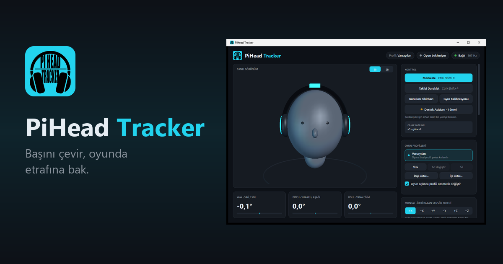
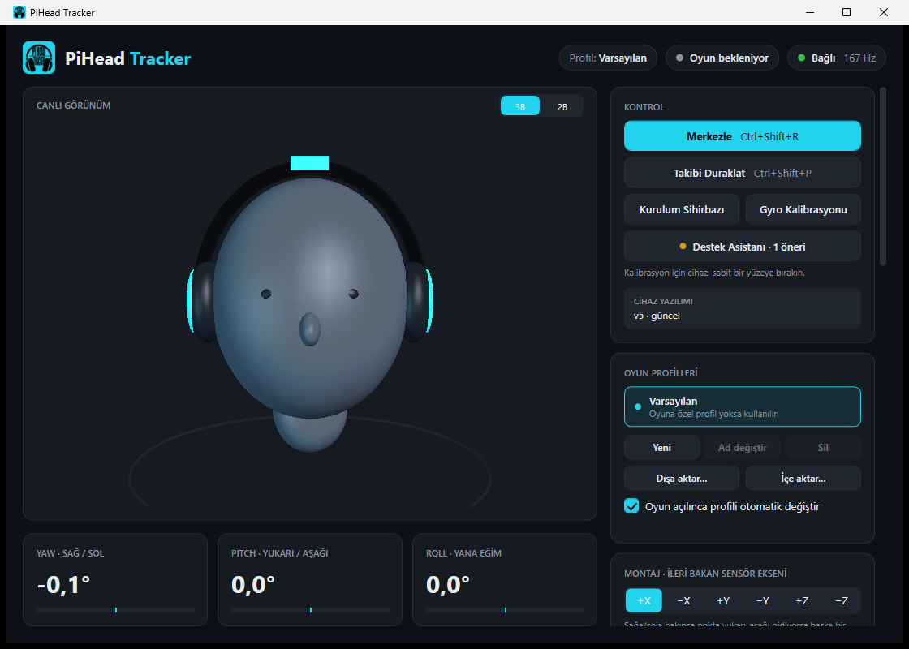
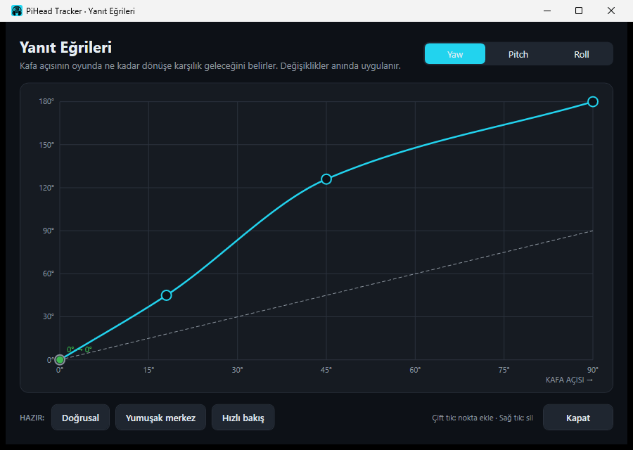
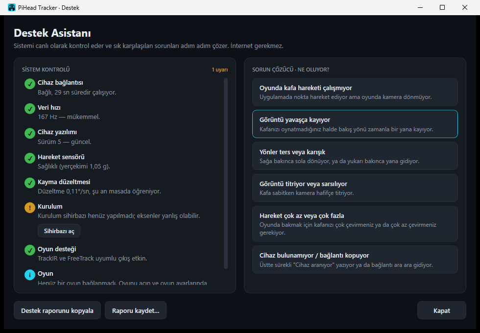

  

  <a href="README.md">English</a> · <b>Türkçe</b>

  <a href="https://piheadtracker.com/">Web sitesi</a> ·
  <a href="https://piheadtracker.com/indir">İndir</a> ·
  <a href="https://piheadtracker.com/kilavuz">Kılavuz</a> ·
  <a href="https://piheadtracker.com/oyunlar">Oyunlar</a> ·
  <a href="https://piheadtracker.com/destek">Destek</a>

PiHead Tracker, kulaklığınızın üst bandına takılan küçük bir kafa takip cihazı. Başınızı sağa çevirdiğinizde oyundaki kamera da sağa döner. Kamera, kızılötesi ışık ya da sürücü kurmanız gerekmez.

Bu sayfada ürünle ilgili duyuruları paylaşıyoruz; siz de görüşlerinizi doğrudan ekibe iletebilirsiniz. Uygulama ve cihaz yazılımı açık kaynak değildir, bu yüzden burada kaynak kodu bulunmaz.

## Nasıl çalışır

Cihaz başınızın ne kadar döndüğünü ölçer, ücretsiz Windows uygulaması da bu açıyı oyuna kamera hareketi olarak iletir. Oyunlar cihazı TrackIR ve FreeTrack arayüzleri üzerinden normal bir kafa takip cihazı olarak görür; oyunda kafa takibini açmanız yeterlidir.

- Sağa ve sola dönüş (yaw)
- Yukarı ve aşağı bakış (pitch)
- Yana eğilme (roll)

PiHead Tracker yalnızca başın dönüşünü takip eder. Öne, arkaya ya da yana kaymayı ölçmez; bunun için kamera tabanlı bir sistem gerekir.

## Uygulama

  

- Montaj yönünü kendisi bulan kurulum sihirbazı
- Her eksen için yanıt eğrisi, hassasiyet ve yumuşatma
- Oyun açılınca kendiliğinden seçilen oyun profilleri
- Uzun oturumlar için otomatik merkezleme ve kayma öğrenme
- Merkezleme ve duraklatma için klavye kısayolu ya da joystick, HOTAS, direksiyon düğmesi
- Bağlantıyı, sensörü ve oyunu kontrol edip sorunu açıklayan Destek Asistanı
- Uygulama ve cihaz için otomatik güncelleme
- Türkçe ve İngilizce arayüz

  
  &nbsp;
  

## Teknik özellikler

| | |
|---|---|
| Takip edilen eksenler | Yaw, pitch, roll |
| Ölçüm hızı | Saniyede yaklaşık 160 ölçüm |
| Sensör | 6 eksenli hareket sensörü (jiroskop ve ivmeölçer) |
| Bağlantı | USB, ayrı sürücü gerekmez |
| Oyun uyumluluğu | TrackIR ve FreeTrack protokolleri |
| İşletim sistemi | Windows 10 ve Windows 11, 64 bit |
| Uygulama | Ücretsiz, Türkçe ve İngilizce, otomatik güncellenir |
| Montaj | Kulaklığın üst bandına, herhangi bir yönde |

## Tartışmalar

[Tartışmalar (Discussions)](../../discussions) bölümünde:

- yeni sürümlerle ilgili duyuruları okuyabilir,
- uygulama ya da cihazla ilgili görüş ve fikirlerinizi paylaşabilir,
- kurulum ve kullanım hakkında soru sorabilir,
- kendi düzeneğinizi gösterebilirsiniz.

Kendi cihazınızla ilgili bir sorunda en hızlı yol uygulamadaki Destek Asistanı'dır. Sorun çözülmezse destek raporunu kopyalayıp [destek@piheadtracker.com](mailto:destek@piheadtracker.com) adresine gönderin.

## Satın alma

Cihaz yalnızca güvenilir satış platformları üzerinden satılacak. Satış henüz başlamadı; duyurular burada ve [web sitesinde](https://piheadtracker.com/) paylaşılacak.

---

© 2026 PiHead Tracker ekibi. Tüm hakları saklıdır. TrackIR, NaturalPoint, Inc. şirketinin ticari markasıdır. PiHead Tracker'ın NaturalPoint ile bir bağlantısı yoktur.
